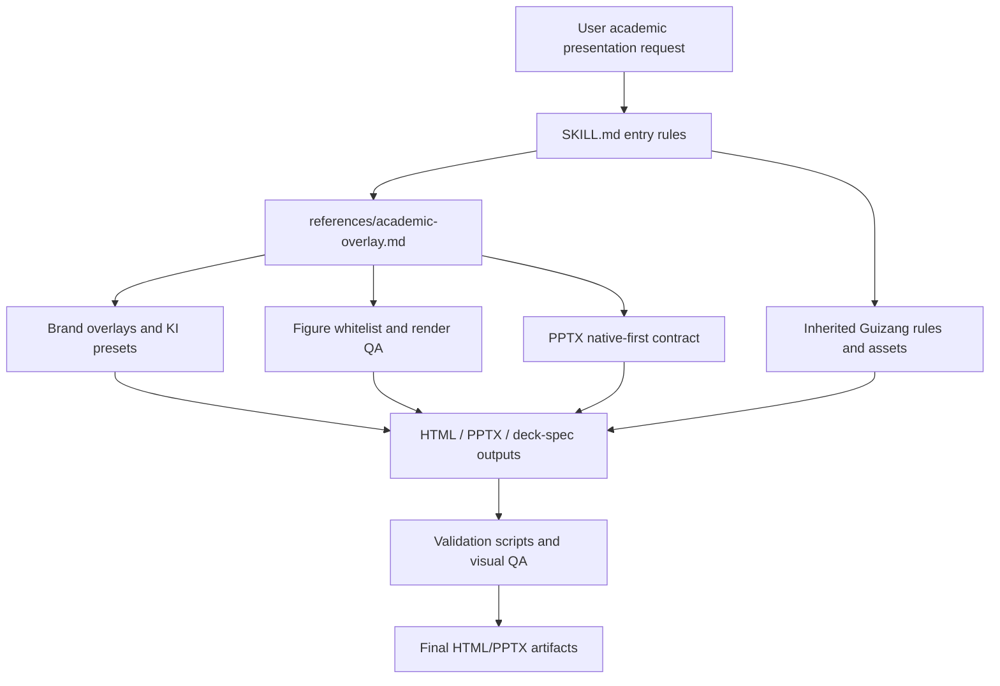

# Academic PPT Architecture

## Structure

- `SKILL.md` is the runtime entrypoint. It loads Guizang first, then applies the Academic PPT overlay.
- `references/academic-overlay.md` is the main Academic policy layer for scientific fidelity, PPTX native-first behavior, and figure/table handling.
- `references/figure-generation-whitelist.md`, `references/figure-render-qa.md`, and related figure/table references define when scientific visuals may be rendered as coherent images and how they are verified.
- `references/brand-overlay.md`, `references/brand-profile.md`, `references/ki-templates.md`, and KI-specific references define frozen institutional branding overlays.
- `assets/` contains Guizang and KI templates plus brand assets.
- `scripts/` contains validators, renderers, brand-token checks, and PPTX normalization helpers.

## External boundaries

The skill may use the normal slide-generation, browser-render, filesystem, and PowerPoint/PPTX tooling required by the Guizang workflow. Figure editability remains within the native PowerPoint/deterministic figure workflow; no external decomposition path is part of the runtime.
